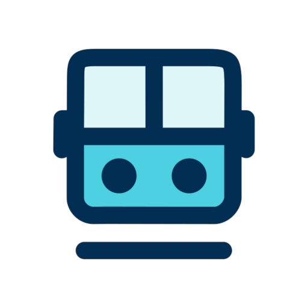
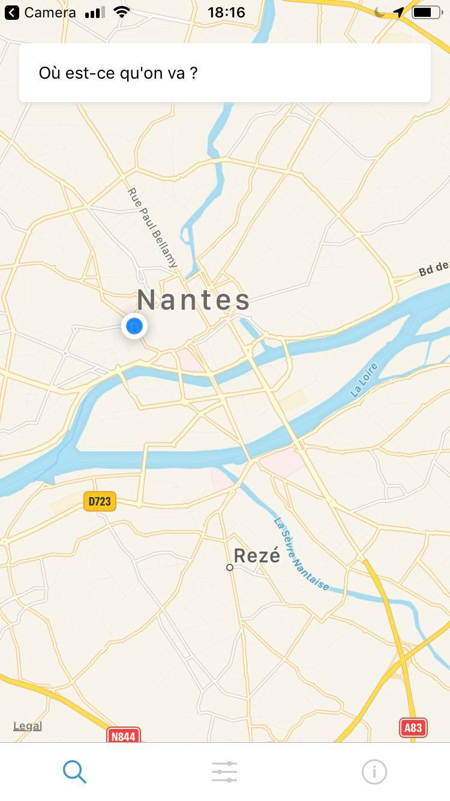
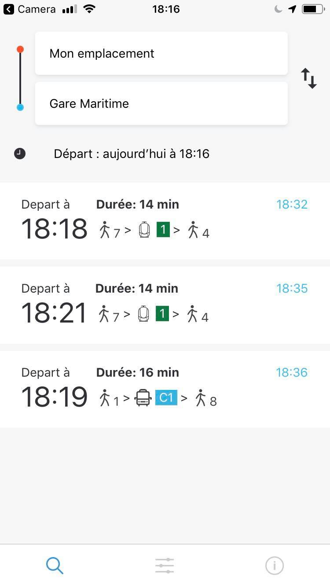
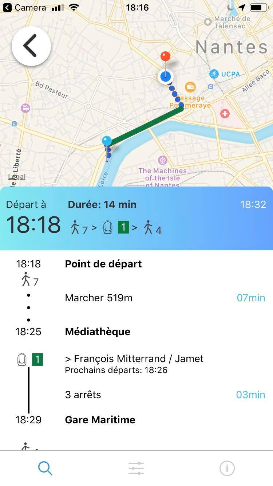
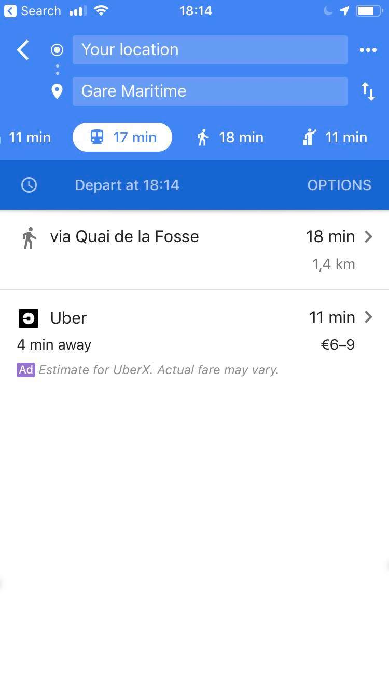
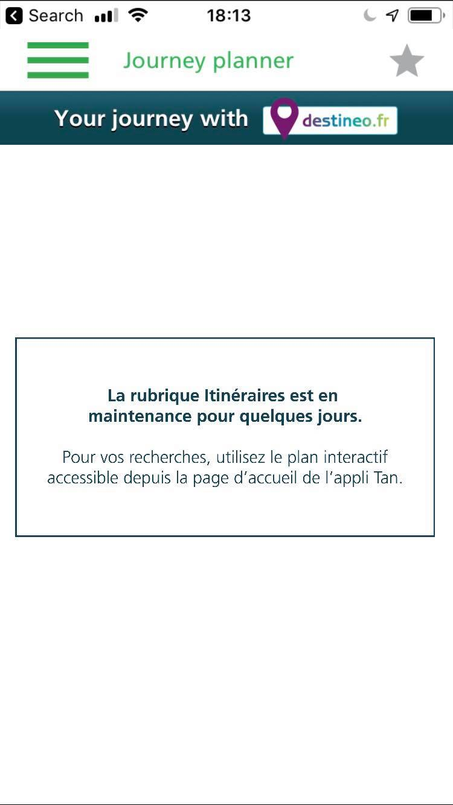
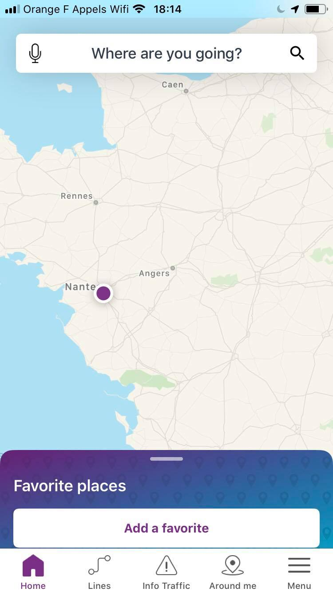
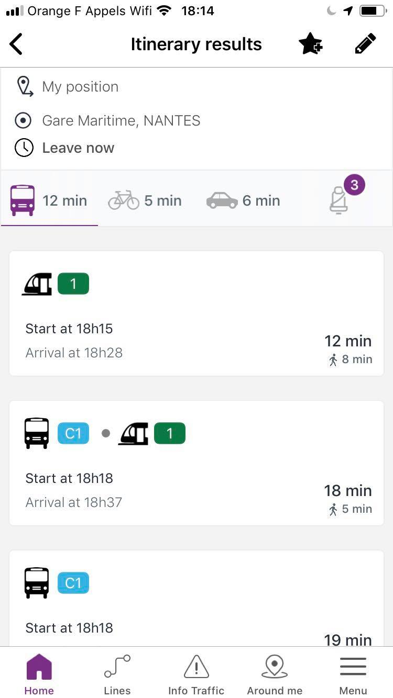
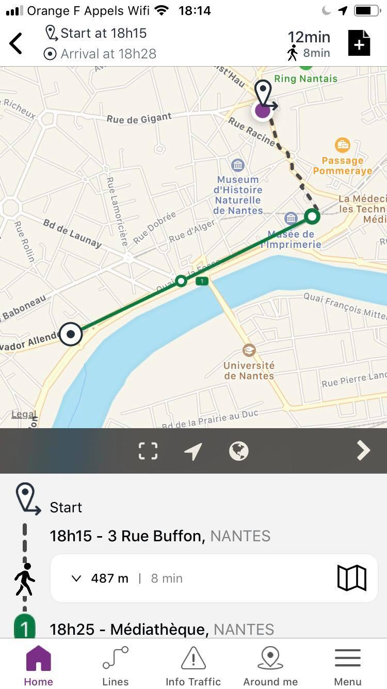

<h1>Taka - Mobile Application</h1>

  
  
  

### Taka:

* ✔ Open Source project
* ✔ All Contributions are welcome
* ✔ Public project roadmap
* ✔ Decent UX
* ✔ Works but it has not been stress tested

  
  
  

### Google Maps:
* ✔ has a good UX
* ❌ but doesn't work for public transportation in Nantes

  

> 🤑  grab a uber

> 🚶  let's go for a walk ᕕ( ᐛ )ᕗ

### TAN application:
* ❌ has a terrible UX
* ✔ but it works

  

> 🐛 well it doesn't work 100% of the time

### Destineo:

* ✔ has a decent UX
* ✔ is actually great, can't deny that
* ❌ closed source
* ✔ good source of inspiration

  
  
  

  
  
  
